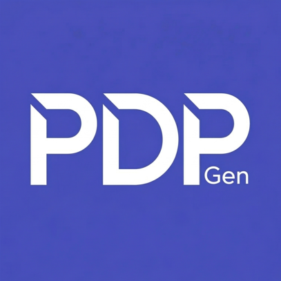

<div align="center">



# PDP AI

**AI-Powered Personal Development Plan Generator**

A web application that helps students create professional, structured Personal Development Plans using AI. Answer a curated questionnaire covering personality, cognitive style, locus of control, SWOT analysis, and career goals — and receive a complete PDP document generated in real-time.

[](LICENSE)


</div>

---

## ✨ Features

- **AI-Powered Generation** — Uses free LLMs via OpenRouter to analyze your profile and produce a full PDP.
- **Real-Time Streaming** — Watch your plan generate word-by-word with live Markdown rendering.
- **Built-In Assessments** — Integrated KPC (Knowledge, Personality, Character) and Locus of Control calculators.
- **Big Five Personality Integration** — Captures OCEAN percentile scores for deep personality analysis.
- **SMART Goals & SWOT** — Structured goal-setting and SWOT analysis sections in every plan.
- **Multiple Export Formats** — Save as **PDF**, **Word (.doc)**, or **Markdown (.md)**.
- **Free Model Selection** — Choose from available free AI models with a searchable dropdown.
- **Auto-Save Inputs** — All form data persists in localStorage — never lose your progress.
- **Premium UI** — Clean, modern interface with smooth animations, responsive layout, and dark footer.

## 🛠️ Tech Stack

| Layer | Technology |
|---|---|
| **Frontend** | React 19, Vite 8 |
| **Routing** | React Router DOM 7 |
| **AI Backend** | OpenRouter API (Vercel Edge Function) |
| **Styling** | Vanilla CSS (custom design system) |
| **Markdown** | React Markdown + Rehype-Raw |
| **Icons** | Lucide React |

## 🚀 Getting Started

### Prerequisites

- Node.js v18+
- npm or yarn
- OpenRouter API Key — [Get one free](https://openrouter.ai/)

### Installation

1. **Clone the repository**

   ```bash
   git clone https://github.com/thisal-d/pdp-gen-S.git
   cd pdp-gen-S
   ```

2. **Install dependencies**

   ```bash
   npm install
   ```

3. **Set up environment variables**

   Create a `.env` file in the project root:

   ```env
   OPENROUTER_API_KEY=your_openrouter_api_key_here
   ```

4. **Start the development server**

   ```bash
   npm run dev
   ```

5. **Build for production**

   ```bash
   npm run build
   ```

## 📂 Project Structure

```
├── api/
│   └── openrouter.js        # Vercel Edge Function (AI proxy)
├── public/
│   └── favicon/              # App icons (407x407, 1540x1540)
├── src/
│   ├── components/           # Header, Footer
│   ├── data/
│   │   ├── questions.json    # Form questionnaire
│   │   ├── prompt.md         # AI generation prompt
│   │   ├── sampleData.json   # Default form values
│   │   └── *.md / *.json     # Assessment prompts & questions
│   ├── pages/
│   │   ├── FormPage.jsx      # Main questionnaire form
│   │   ├── ResultPage.jsx    # PDP output & export
│   │   ├── KpcPage.jsx       # KPC assessment calculator
│   │   └── LocusPage.jsx     # Locus of Control calculator
│   ├── services/
│   │   └── aiService.js      # AI streaming client
│   ├── App.css               # Design system & styles
│   ├── App.jsx               # Router & layout
│   └── main.jsx              # Entry point
├── .env.example
├── vercel.json
└── package.json
```

## 📄 License

This project is licensed under the MIT License — see the [LICENSE](LICENSE) file for details.

## 🤝 Contributing

Contributions, issues, and feature requests are welcome! Feel free to open an issue or submit a pull request.

---

<div align="center">

Built with ❤️ by [Senuda](https://github.com/senuda-d) & [Thisal](https://github.com/thisal-d)

</div>
